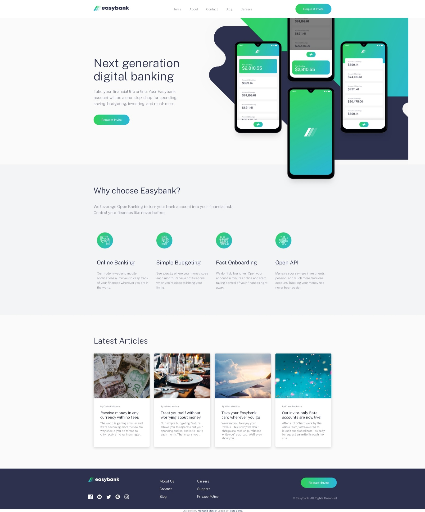
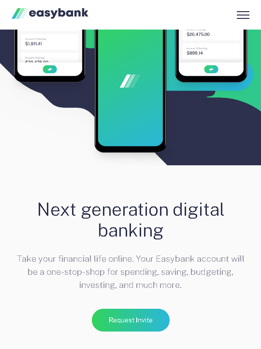
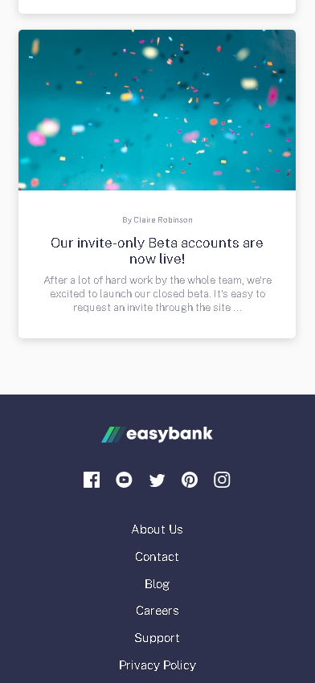

# Frontend Mentor - Easybank landing page
## Live Site avaiable here
https://tobiazamo.github.io/easybank-lading-page/

Frontend Mentor coding challenge.

## Table of Content:

- [About](#about)
- [Screenshots](#screenshots)
- [Technologies](#technologies)
- [Status](#status)
- [Credits](#credits)

## About

A frontend code challenge by [frontendmentor.io](https://frontendmentor.io). The goal of the challenge is to build a landing page that is responsive on both mobile and desktop.

## Screenshots

## Technologies

- HTML5
- Sass(CSS3)

## Status

`Completed`

## Credits

- Frontend Mentor
